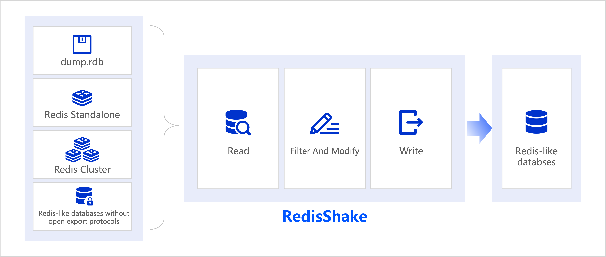

# RedisShake: Redis Data Transformation and Migration Tool

[](https://github.com/tair-opensource/RedisShake/actions/workflows/ci.yml)
[](https://tair-opensource.github.io/RedisShake/)
[](https://github.com/tair-opensource/RedisShake/releases)
[](https://github.com/tair-opensource/RedisShake/pkgs/container/redisshake)

- [中文文档](https://tair-opensource.github.io/RedisShake/)
- [English Documentation](https://tair-opensource.github.io/RedisShake/en/)



## Overview

RedisShake is a powerful tool for Redis data transformation and migration, offering:

1. 🔄 **Zero Downtime Migration**: Enables seamless data migration without data loss or service interruption, ensuring continuous operation during the transfer process.

2. 🌈 **Redis Compatibility**: Supports Redis 2.8 to 7.2, across standalone, master-slave, sentinel, and cluster deployments.

3. ☁️ **Cloud Service Integration**: Seamlessly works with Redis-like databases from major cloud providers:
   - Alibaba Cloud: [ApsaraDB for Redis](https://www.alibabacloud.com/product/apsaradb-for-redis), [Tair](https://www.alibabacloud.com/product/tair)
   - AWS: [ElastiCache](https://aws.amazon.com/elasticache/), [MemoryDB](https://aws.amazon.com/memorydb/)  

4. 🧩 **Module Support**: Compatible with [TairString](https://github.com/tair-opensource/TairString), [TairZSet](https://github.com/tair-opensource/TairZset), and [TairHash](https://github.com/tair-opensource/TairHash).

5. 📤 **Flexible Data Source**: Supports [PSync](https://tair-opensource.github.io/RedisShake/zh/reader/sync_reader.html), [RDB](https://tair-opensource.github.io/RedisShake/zh/reader/rdb_reader.html), and [Scan](https://tair-opensource.github.io/RedisShake/zh/reader/scan_reader.html) data fetch methods.

6. 🔧 **Advanced Data Processing**: Enables custom [script-based data transformation](https://tair-opensource.github.io/RedisShake/zh/filter/function.html) and easy-to-use [data filter rules](https://tair-opensource.github.io/RedisShake/zh/filter/filter.html).

## How to Get RedisShake

1. Download from [Releases](https://github.com/tair-opensource/RedisShake/releases).

2. Use Docker:
```shell
docker run --network host \
    -e SYNC=true \
    -e SHAKE_SRC_ADDRESS=127.0.0.1:6379 \
    -e SHAKE_DST_ADDRESS=127.0.0.1:6380 \
    ghcr.io/tair-opensource/redisshake:latest
```

3. Build it yourself:
```shell
git clone https://github.com/tair-opensource/RedisShake
cd RedisShake
sh build.sh
```

## How to Use RedisShake

To move data between two Redis instances and skip some keys:

1. Make a file called `shake.toml` with these settings:
```toml
[sync_reader]
address = "127.0.0.1:6379"

[redis_writer]
address = "127.0.0.1:6380"

[filter]
# skip keys with "temp:" or "cache:" prefix
block_key_prefix = ["temp:", "cache:"] 
```

2. Run RedisShake:
```shell
./redis-shake shake.toml
```

For more help, check the [docs](https://tair-opensource.github.io/RedisShake/zh/guide/mode.html).

## History

RedisShake, actively maintained by the [Tair team](https://github.com/tair-opensource) at Alibaba Cloud, evolved from [redis-port](https://github.com/CodisLabs/redis-port). Key milestones:

- [RedisShake 2.x](https://github.com/tair-opensource/RedisShake/tree/v2): Improved stability and performance.
- [RedisShake 3.x](https://github.com/tair-opensource/RedisShake/tree/v3): Complete codebase rewrite, enhancing efficiency and usability.
- [RedisShake 4.x](https://github.com/tair-opensource/RedisShake/tree/v4): Enhanced readers, configuration, observability, and functions.

## License

RedisShake is open-sourced under the [MIT license](https://github.com/tair-opensource/RedisShake/blob/v2/license.txt).
