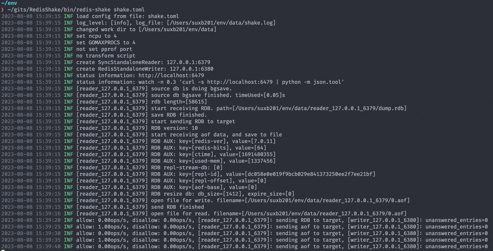

# 快速上手

## 安装

### 下载二进制包

直接在此处下载：https://github.com/tair-opensource/RedisShake/releases

### 从源码编译

确保本地有 Golang 环境：

```shell
git clone https://github.com/alibaba/RedisShake
cd RedisShake
sh build.sh
```

## 运行

假设现在有两个 Redis 实例：

* 实例 A：127.0.0.1:6379
* 实例 B：127.0.0.1:6380

新建文件 `shake.toml`：

```toml
[sync_standalone_reader]
address = "127.0.0.1:6379"

[redis_standalone_writer]
address = "127.0.0.1:6380"
```

启动 redis-shake：

```shell
./redis-shake shake.toml

```

运行日志如图：

